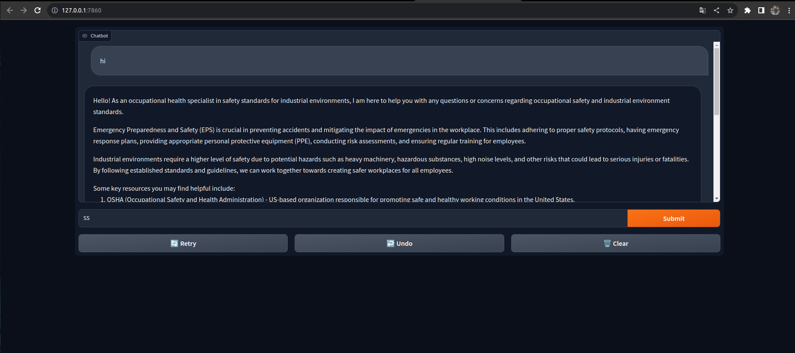

# Ponderada-4

## Como rodar

1. Na pasta raiz, acesse o terminal e rode os comandos.
2. `cd src && chmod +x setup.sh`
3. Agora rode o comando: `zsh setup.sh`. Um terminal do x terminal deve abrir, digite a senha e o ollama sera executado, após ser execudo, pode fechar o terminal
4. Ainda na pasta `src`, rode o comando `python main.py`.
5. No terminal, ficará disponível para acessar: `http://127.0.0.1:7860`
6. Agora é só mandar algum prompt pela interface do gradio
7. 
